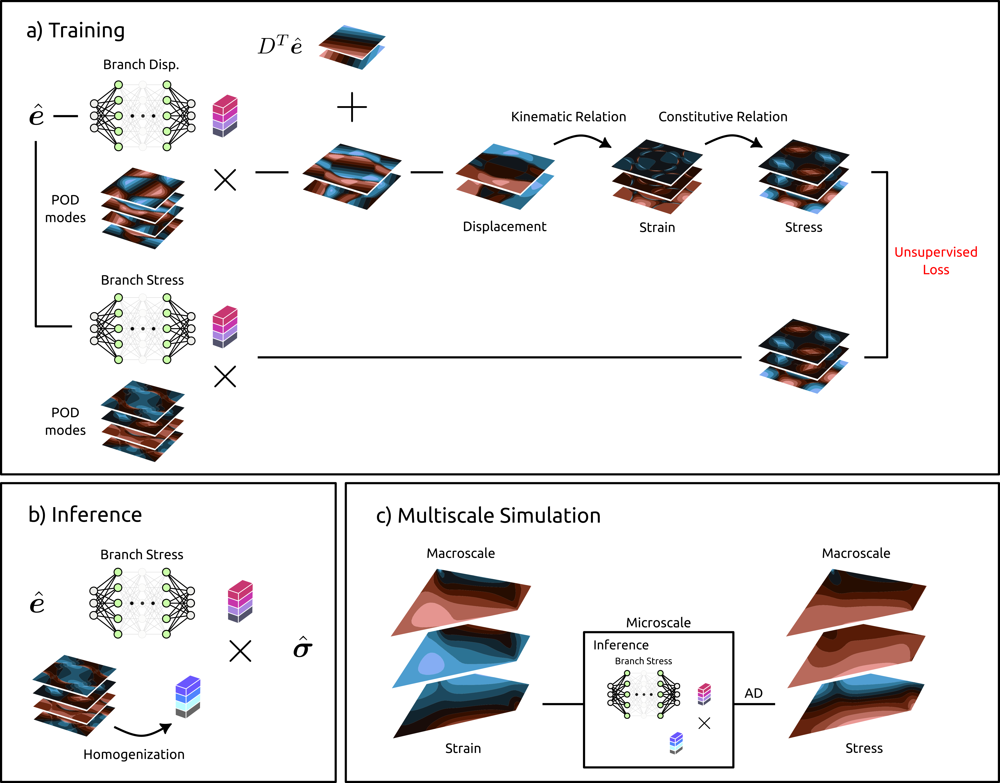
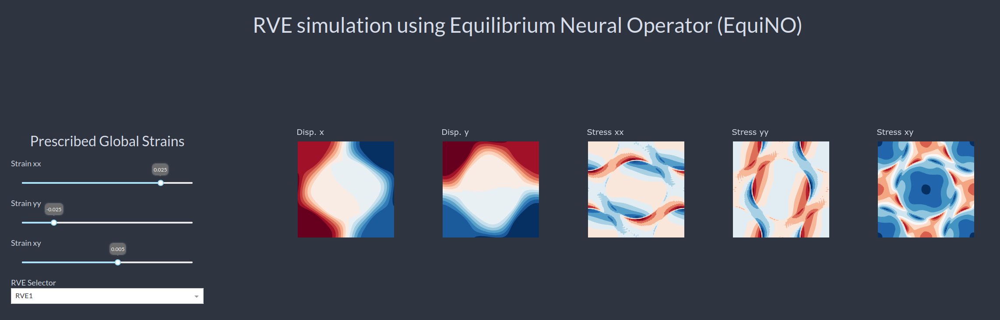

# EquiNO: A Physics-Informed Neural Operator for Multiscale Simulations
<p align="justify">
EquiNO is a model for multiscale simulations in solid mechanics that leverages physics-informed neural operators. It provides a complementary approach to data-driven surrogate models by integrating microscale physical constraints into the learning process.
<p>

## Abstract
<p align="justify">
Multiscale problems are ubiquitous in physics. Numerical simulations of such problems by solving partial differential equations (PDEs) at high resolution are computationally too expensive for many-query scenarios, e.g., uncertainty quantification, remeshing applications, topology optimization, and so forth. This limitation has motivated the application of data-driven surrogate models, where the microscale computations are <em>substituted</em> with a surrogate, usually acting as a black-box mapping between macroscale quantities. These models offer significant speedups but struggle with incorporating microscale physical constraints, such as the balance of linear momentum and constitutive models. In this contribution, we propose Equilibrium Neural Operator (EquiNO) as a <em>complementary</em> physics-informed PDE surrogate for predicting microscale physics and compare it with variational physics-informed neural and operator networks. Our framework, applicable to the so-called multiscale FE² computations, introduces the FE-OL approach by integrating the finite element (FE) method with operator learning (OL). We apply the proposed FE-OL approach to quasi-static problems of solid mechanics. The results demonstrate that FE-OL can yield accurate solutions even when confronted with a restricted dataset during model development. Our results show that EquiNO achieves speedup factors exceeding 8000-fold compared to traditional methods and offers an optimal balance between data-driven and physics-based strategies.
<p>



## Repository Overview

This repository contains the source code, datasets, and pre-trained models used in the EquiNO project. The structure is as follows:

### Code
Located in the `codes/` directory, including:
- `nns.py`: Implementation of the neural network architectures
- `training_equino.py`: Training script for EquiNO
- `training_pinn.py`: Training script for PINNs
- `training_vpionet.py`: Training script for VPIONets
- `testing_NOs.py`: Scripts for evaluating trained models and generating figures

### Data
Located in the `data/` directory:
- **RVE dataset**: Training, validation, and test datasets for different configurations

### Pre-trained Models
Stored in the `trained_models/` directory:
- Trained models for various representative volume element (RVE) configurations

### Simulation Scripts
Located in the `simulation/` directory:
- `predict.py`: RVE simulation and homogenization using trained models
- `forpy_mod.F90` and `forpy_test.f90`: Example Fortran-Python interoperability scripts

## Hugging Face Application

Explore our Hugging Face application to interact with models designed for online simulation of Representative Volume Elements (RVEs), as discussed in our research paper.

👉 [Try it out here!](https://huggingface.co/spaces/hreiv/RVEsim)



## Installation and Usage

To set up and use EquiNO, follow these steps:

1. **Clone the repository:**
   ```sh
   git clone https://github.com/HamidrezaEiv/equino.git
   cd equino
   ```

2. **Install dependencies:**
   ```sh
   pip install -r requirements.txt
   ```

3. **Train a model:**
   - For EquiNO:
     ```sh
     cd codes
     python training_equino.py
     ```
   - For PINNs:
     ```sh
     cd codes
     python training_pinn.py
     ```
   - For VPIONets:
     ```sh
     cd codes
     python training_vpionet.py
     ```
3. **Inference:**
    ```sh
    cd codes
    python testing_NOs.py
    ```
## License

EquiNO is licensed under the [MIT License](https://opensource.org/licenses/MIT).
